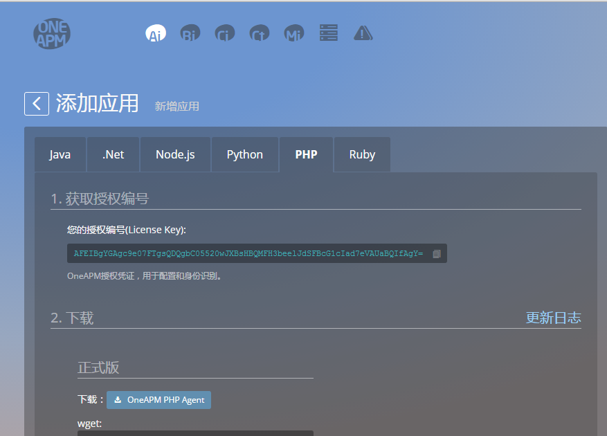

# Agent 安装

欢迎来到OneAPM，接下来本教程将指引如何成功的安装 AI 探针：

注册登陆之后，会看到这个页面：

如上图所示， 按照箭头指示点击相应的产品进入，以AI为例。
点击进入之后，会看到这样一个页面：

同样在所给出的不同栏目，点击你需要的语言栏，下拉可以看到 license key、下载、安装步骤。

每种语言按照安装步骤安装，出现安装成功提示之后，根据重启提示重启相应服务，等待三到五分钟，点击最下面的返回应用列表。
如下图提示有隐藏应用，恭喜安装成功！

两分钟之后，刷新一下页面：

 
  
  恭喜您，点进去就可以看到您的应用数据了。  