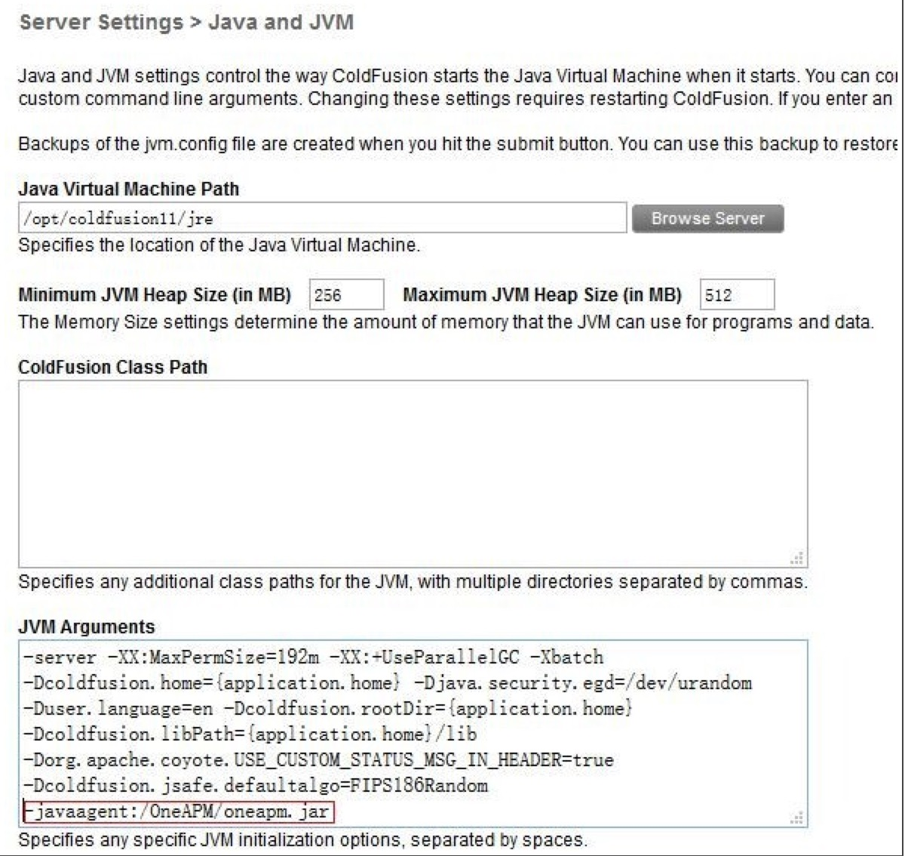
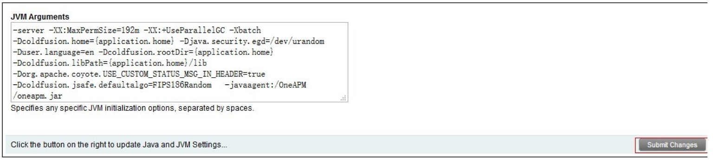

# ColdFusion 中部署方法
* ColdFusion 应用服务器 Java Agent 安装步骤：

* 第一步：登陆到 ColdFusion 的 Administrator Console.

* 第二步：在左侧的导航栏中选择 SERVER SETTINGS > Java and JVM.

* 第三步：在 JVM Arguments 文本框中, 添加 -javaagent 标签:

 ```
 -javaagent:/full/path/to/oneapm.ja
 ```
 
* 第四步：点击提交并重新启动。


