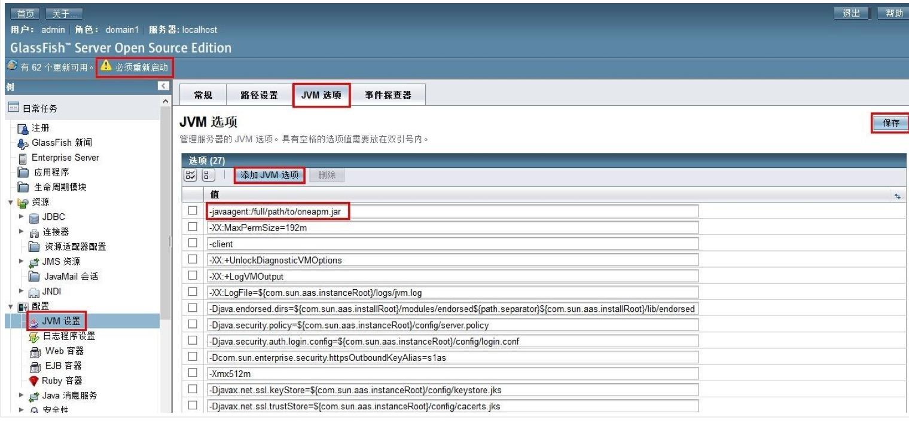

# Glassfish中部署方法

部署方法如下：
* 1.访问 GlassFish 控制台

* 2.在左侧的导航栏中选择 配置 > JVM 设置 > JVM 选项

* 3.在 JVM 选项页面，选择 添加 JVM 选项

* 4.添加一项 -javaagent 标签

 ```
-javaagent:/full/path/to/oneapm.jar
```
* 5.注意：-javaagent:后面跟的是oneapm.jar的绝对路径

* 6.点击保存并重新启动

* 7.配置 > JVM 设置 > JVM 选项: 在 JVM 选项 页面添加 javaagent选项。

* 8.如果 Glassfish 没有正常启动，表明 -javaagent 选项没有设置正确。您可以通过编辑 domain.xml 文件(glassfish/domains/{domain}/config/domain.xml)改变服务器 JVM 选项。
