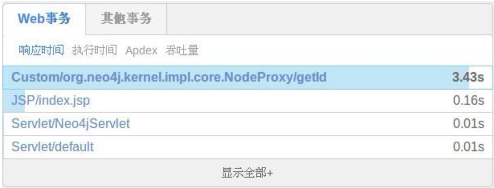

# Java

标签（空格分隔）： 常见问题

---
 [TOC]

### 1.如何对指定 jar 包进行监控

* 在 jar 的启动命令中执行如下命令，即可完成对指定 jar 的监控：

 ```
 java -javaagent: oneapm.jar -jar *.jar
 ```
 **注意：**
* -javaagent: 后面跟 oneapm.jar 的绝对路径
* jar 后面跟要监控的 jar 的路径
* 这种方式同时支持，使用 spring boot 内嵌 Web 容器，并将整个应用打包成 jar 包的监控

---


### 2.Java Agent 更新方法

* OneAPM Java Agent 更新，无需卸载 Agent 探针，再重新部署。您只需遵循以下步骤，来完成 Agent 的更新：

* 在安装步骤页面，下载 Java 最新版本 Agent。

* 解压出 OneAPM_java_agent_x.x.x.zip 中的 oneapm.jar 文件。

* 替换掉原有版本的 oneapm.jar 文件，至最新版本。

* 配置文件 oneapm.properties 替换至最新版本
 
* 内容需要按照 properties 中的重新配置一下
重启应用服务器。


* 查看新版本的 Agent 是否可以正常地向 OneAPM 发送数据。


---

### 3.如何使用OneAPM的 extensions 拓展功能
如何对不支持的同步框架做扩展配置

Extension 可以针对 Java Agent 不支持的同步框架做扩展配置。比如目前 Java Agent 不支持 neo4j，就可以使用这种方式解决。

在 oneapm.jar 同级目录创建文件夹 extensions(注意：3.1.8及以后的探针不用自己建立，已经有了)

```
mkdir extensions
cd extensions  //在新建的目录下面创建文件
touch neo4j.xml    //创建扩展配置文件
```
例1：
```
<?xml version="1.0" encoding="UTF-8"?>
    <extension
    xmlns="https://blueware.com/docs/java/xsd/v1.0"
    xmlns:xsi="http://www.w3.org/2001/XMLSchema-instance"
    name="graphdb.extension"
    version="1.8">
    <instrumentation>
        <pointcut>
            <nameTransaction/>
            <interfaceName>org.neo4j.graphdb.Node</interfaceName>
            <method>
                <name>*</name>
            </method>
        </pointcut>
    </instrumentation>
    </extension>
```
**参数解释：**

* name 是扩展的唯一标识，不可重复。
* version 高版本会覆盖低版本配置，如果 Java Agent 内部配有同名低版本extension，则会执行升级操作。
* Pointcut 定位有四种方式 annotationName、interfaceName、className、packageName，neo4j 的 Node 是一个 interface，所以此处配置为 interfaceName。
* method name 当前只支持通配*

**配置完成后，重启 Java Agent 生效：**

也可以这样配置

例2:
```
<?xml version="1.0" encoding="UTF-8"?>
    <extension
        xmlns="https://blueware.com/docs/java/xsd/v1.0"
            xmlns:xsi="http://www.w3.org/2001/XMLSchema-instance"
            name="org.webservice" version="1.8">
            <instrumentation>
                <pointcut>
                <nameTransaction/>
                <className>com.etc.webbookshop.service.impl.BookServiceImpl</className>
                    <method>
                    <name>*</name>
                    </method>
                </pointcut>
                <pointcut>
                <nameTransaction/>
                <interfaceName>com.etc.webbookshop.dao.BookDao</interfaceName>
                    <method>
                    <name>*</name>                           
                    </method>
                </pointcut>
            </instrumentation>
    </extension>
```
从 BookService 到 BookDao 是一个业务，这里采用 className 和 interfaceName 的方式配置扩展，达到业务配置的目的。（备注：在这里配置扩展，不一定会在 server 端看到它们的事务，响应时间达到要求才会显示）

packageName 的配置要慎重，包下可能包含大量的 class。如果不想全部 class 都监控，可以定义模糊配置。

例3:

```
<?xml version="1.0" encoding="UTF-8"?>
    <extension
        xmlns="https://blueware.com/docs/java/xsd/v1.0"
        xmlns:xsi="http://www.w3.org/2001/XMLSchema-instance"
        name="org.webservice" version="1.8">
        <instrumentation>
            <pointcut>
            <nameTransaction/>
            <packageName>com.etc.webbookshop.service.impl.*ServiceImpl</packageName>
            <method>
                <name>*</name>
            </method>
            </pointcut>
        </instrumentation>
    </extension>
```
com.etc.webbookshop.service.impl 包下的以 ServiceImpl 结尾的 class

extension 功能帮助： 

只有 packageName 可以使用 *，使用规范，使用类名路径的一部分前缀或一部分前缀+ * +后缀

使用时配置文件如果没有报错，说明 extension 的配置就成功了。配置文件报错会在 Agent 启动最开始打印在 oneapm.log 中。

排错方法：

如果以上都通过了，server 端没有收到配置的数据，检查匹配是否填写正确，配置的类是否会被调用，是否异步调用。

以上方法都用了，可以找研发协助。


---


### 4.内网服务器如何部署OneAPM

* 使用场景：

 nginx 有外网 IP，可以访问外网，tomcat 不能上网，nginx 反向代理到 tomcat进行客户正常的业务运行，我们想为tomcat安装探针将数据发送到 oneapm 时，就需要在有外网 IP 的 nginx 上配置 squid 做代理，探针收集内网 tomcat 的性能数据后，通过 nginx 的 squid 将数据传送给 oneapm server。
* 以 Linux 为例，简易配置 squid 的配置步骤如下：

  1.Yum 安装
  ```
  yum -y install squid
  ```
  2.初始化 squid ，生成 cache 目录
  ```
  squid -z
  ```
  3.配置 squid
  ```
  vi /etc/squid.conf
  ```
  4.添加acl访问规则：
  ```
  acl 名称 src 客户内网网段/掩码
  ```
  例：
  ```
  acl oneapm src 192.168.0.0/24
  ```
* 设置允许访问权限
  ```
  http_access allow oneapm
  ```
  1.启动squid
  ```
  service squid start
  ```
  2.编辑 oneapm.properties 或者 oneapm.yml
  ```
  proxy_host squid的主机地址
  proxy_port 3128
  ```
  3.启动oneapm探针
  
* 注意事项:
安装 squid 记得配置安全规则，3128端口不要暴露在外网，仅提供内网访问即可。其它安全方法也可以为 squid 配置用户名密码认证，配置认证后，你还需要为 oneapm.properties 或者 oneapm.yml 添加 proxy 的用户与密码。

* 其它 squid 版本下载：http://www.squid-cache.org/Versions/

---


### 5. windows下的Tomcat 部署oneapm后看不到数据;

* 回答:首先查看有没有／OneAPM／logs目录，如果不存在，就是oneapm就是没有部署成功，首先查看 tomcat bin/catalina.bat 脚本中 JAVA_OPTS="-Xmx1024m -Xms512m"中的设置，然后
   设置为JAVA_OPTS="-Xmx1024m -Xms512m －javaagent:/path/to/oneapm.jar" 然后重启tomcat,可以解决你的问题。注意：-javaagent:后面跟安装oneapm.jar的绝对路径；


### 6. windows 启动tomcat后可以看到／OneAPM/logs，看不到oneapm数据；

* 回答：遇到这种情况，排查方法如下：

 1.排查网络是否跟oneapm正常打通，执行命令 telnet tpm.oneapm.com 443 或者 ping tpm.oneapm.com，如果不通请检查网络环境，并修复，确认可以跟oneapm打通；

 2.排查服务器的时间是否为北京时间东八区的时间，如果不是请更新下服务器的时间跟北京东八区的时间保持一致；
 
 3.打开并检查／OneAPM/oneapm.properties文件配置，设置 ssl = true；host = tpm.oneapm.com；port = 443；
 
 4.检查 tomcat 根目录下是否有temp目录，如果没有请手动创建temp目录；例如：
 
 ```
 ➜  apache-tomcat-8.0.28  ls -l
 total 14896
 -rw-r--r--@  1 qinheng  staff    58068 Oct  7 19:26 LICENSE
 -rw-r--r--@  1 qinheng  staff     1489 Oct  7 19:26 NOTICE
drwxr-xr-x@  8 qinheng  staff      272 Nov 26 23:13 OneAPM
-rw-r--r--@  1 qinheng  staff  7530606 Nov 27 09:56 OneAPM.zip
-rw-r--r--@  1 qinheng  staff     6913 Oct  7 19:26 RELEASE-NOTES
-rw-r--r--@  1 qinheng  staff    16682 Oct  7 19:26 RUNNING.txt
drwxr-xr-x@ 26 qinheng  staff      884 Nov 26 23:26 bin
drwxr-xr-x@ 11 qinheng  staff      374 Nov 26 23:28 conf
drwxr-xr-x@ 26 qinheng  staff      884 Nov 26 23:20 lib
drwxr-xr-x@ 13 qinheng  staff      442 Nov 27 10:02 logs
drwxr-xr-x@  9 qinheng  staff      306 Nov 27 21:50 temp
drwxr-xr-x@ 10 qinheng  staff      340 Nov 27 21:50 webapps
drwxr-xr-x@  3 qinheng  staff      102 Nov 26 23:28 work
➜  apache-tomcat-8.0.28
 ```
 
 注意：Tomcat根目录下必须要有temp目录；

### 7.Java开发的 jar包程序 应该如何使用oneapm进行监控？

* 回答：jar包应用根据jar的启动命令加入启动参数 －javaagent:/full/path/to/oneapm.jar ,
例如：
1.通过 执行命令 java -jar test.jar 启动jar程序，想使用oneapm来监控jar程序，正确的执行命令是 java －javaagent:/full/path/to/oneapm.jar -jar test.jar

 2.通过脚本启动jar 程序，脚本模版如下：
```
source /etc/profile 
cd 'dirname $0'
cmd="java -Xms512m -Xmx2048m -XX:PermSize=256m -jar test.jar"
exec ${cmd} 
echo "execute test.jar finish......"
```
正确引入 oneapm.jar 方式 脚本应修改为：
```
cmd="java -Xms512m -Xmx2048m -XX:PermSize=256m －javaagent:/full/path/to/oneapm.jar -XX:PermSize=256m -XX:MaxPermSize=256m -jar test.jar" 
```
注意：－javaagent:后面跟安装oneapm.jar的绝对路径；

### 8.有/OneAPM/logs/目录，网络和时间都正确，看不到oneapm数据；

* 回答：检查／OneAPM的权限，保证／OneAPM／目录及目录下的文件有执行的权限，再重启启动tomcat；
例如：

 ```
➜  apache-tomcat-8.0.28  ls -l OneAPM
total 11864
drwxrwxrwx@ 42 qinheng  staff     1428 Aug 27 02:50 extensions
drwxr-xr-x@ 25 qinheng  staff      850 Aug 27 10:51 lib
drwxr-xr-x   3 qinheng  staff      102 Nov 26 23:13 logs
-rw-r--r--@  1 qinheng  staff  6057639 Aug 27 10:51 oneapm.jar
-rw-r--r--@  1 qinheng  staff    13679 Nov 26 23:10 oneapm.properties
➜  apache-tomcat-8.0.28
```


### 9.Centos下的Tomcat 部署oneapm并重启，看不到oneapm数据；

* 回答：执行 ps aux |grep oneapm 命令，查看oneapm进程是否存在,如果没有，检查tomcat 容器，是否在启动脚本里配置过 VM参数，例如：JAVA_OPTS="-Xmx1024m -Xms512m " ，如果有应修改为 JAVA_OPTS="-Xmx1024m -Xms512m －javaagent:/path/to/oneapm.jar" ；注意：-javaagent:后面跟安装oneapm.jar的绝对路径；


### 10.执行 java -jar oneapm.jar 后 报错：”com.blueware.monitor ERROR: init charset error, using default encoding in Strings utf-8“；

* 回答：oneapm默认使用的utf-8跟你的tomcat的默认编码格式不一致导致的错误，这个错误可以忽略，不影响oneapm的使用；


### 11.部署oneapm后，重启应用服务器后报错"Error bootstrapping oneapm agent:java.lang.RuntimeException: java.io.IOException: No such file or directory",是什么原应啊？

* 回答：这个错误是因为，tomcat 目录缺少 temp目录，手动创建temp目录，再重启tomcat就不再会有这个报错；


### 12.错误信息”中没有 Sample Stack Trace;

* 回答：当错误被快速重复抛出，基于性能的考虑，Java 编译器可能会优化掉 Sample stack trace 。若要禁用该优化，您可以在 JVM 参数中加上：
-XX:-OmitStackTraceInFastThrow;


### 13.重启应用服务器后抛出 Error opening zip file: oneapm.jar ；

* 回答：原因：Agent jar 包的访问路径在 -javaagent JVM 选项中是完全限定的。如果没有正确地指定路径，该错误会在应用程序服务器启动时抛出，并且 JVM 也会退出运行。
解决办法：指定到 -javaagent 选项中 oneapm.jar 文件的完整路径。例如，如果 oneapm.jar 文件是在 Tomcat 主目录 /home/tomcat 中的 OneAPM 目录下，该选项应该以如下方式指定：-javaagent:/home/tomcat/oneapm/oneapm.jar 注意：-javaagent:后面跟oneapm.jar安装的绝对路径;


### 14.重启 Tomcat 后，日志报错，：“blueware 1 ERROR: license_key is expired in the config, not starting BlueWare Agent”；

* 回答：原因：License 许可过期。
解决方法：1.重新登陆 OneAPM 生成 License Key；2.将 License Key 复制并写入到探针的 oneapm.properites 文件中；3.重启 Tomcat；

### 15.Dubbo框架开发的jar程序,看不到数据；


