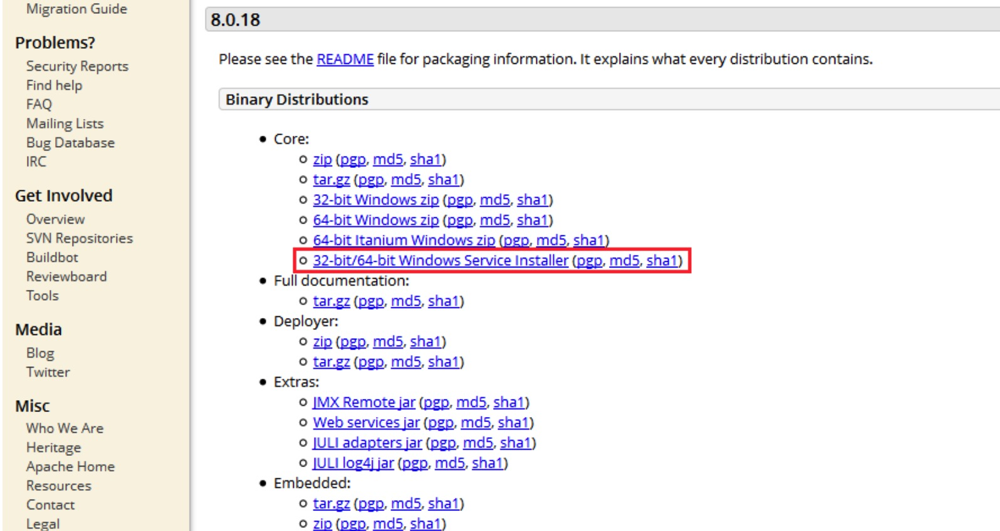
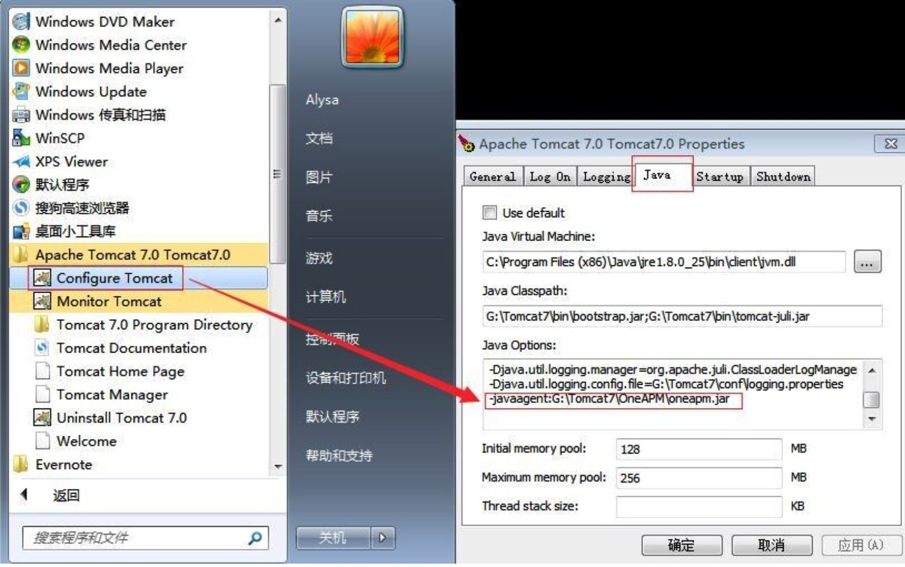
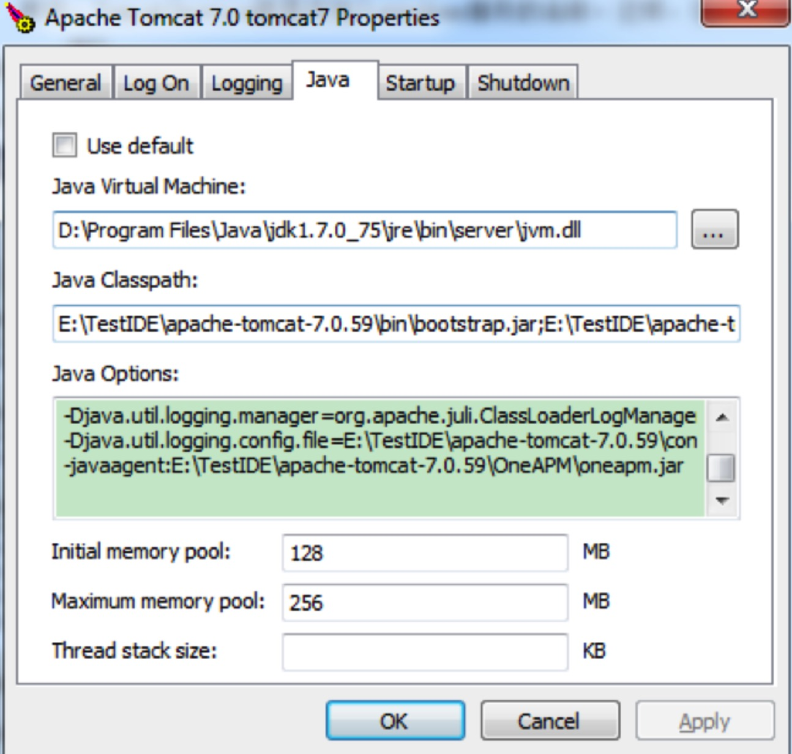

# Java 部署 OneAPM后无数据显示

####**故障说明**

* 成功安装了 Java Agent，但是官网上无法看到性能数据。


#### **故障原因**


* 1、 如果您是在windows中使用的tomcat容器，请按以下方法解决

 **（1）如果是在windows环境中使用安装版的tomcat，请参考tomcat手动安装方法：**
  
  **Tomcat for Windows**
  
  大多数的 Windows 用户使用 Tomcat 作为应用服务器使用。Apache Tomcat 分为免安装和安装版两种，下图是Tomcat官网安装版的下载界面。本文档主要介绍使用Tomcat安装版作为应用服务器的应用程序如何安装 OneAPM Java Agent ，从而监控应用程序的运行情况。
  
  
 **Tomcat 应用服务器 Java Agent 安装步骤：**
 
   * 1.登录 OneAPM 网站，下载 Java Agent 压缩包到本地。

   * 2.解压 OneAPM Java Agent 压缩包到 Tomcat 根目录下。OneAPM 文件夹包含 oneapm.jar 、 oneapm.properites 和 lib 文件夹。

  * 3.开始 -> Apache Tomcat -> Configure Tomcat

  * 4.选择 Java 选项卡。

  * 5.在 Java Options 文本框中, 添加 -javaagent 标签，路径为 oneapm.jar 的完整路径 。

   ```
   -javaagent:G:\full\path\to\oneapm.jar
   ```

 * 6.选择 Apply
 * 7.重启 Tomcat。



**（2）如果是在windows环境中将tomcat注册成了服务，请参考windows下tomcat服务手动安装java探针：**

 **Windows下Tomcat服务手动配置Java探针**
 *  比如您使用的是tomcat7，先切换到tomcat的bin目录下，然后在命令行下执行：tomcat7w.exe //ES//TomcatService， 其中，TomcatService就是你加入windows服务的名称。这样，在windows的任务栏就会出现一个tomcat的服务管理器，图标如：
 

* 
打开tomcat服务管理器的java页，如


* 切换到java选项卡下，在 Java Options 文本框中, 添加 -javaagent 标签，路径为 oneapm.jar 的完整路径 ：
-javaagent:G:\full\path\to\oneapm.jar；
* 选择Apply；
* 重启Tomcat；
* 最后，访问您的应用，等1-2分钟后，就可以看到性能数据了。
* 


####** 解决方案**
* 第一步：确定 Agent 目录有权限访问；


* 第二步：确认服务器是否能连接外网，使用 ping tpm.oneapm.com 来检查。如果服务器不能连接外网，则agent不能将性能数据上传到oneapm云服务器；


* 第三步：telnet tpm.oneapm.com 443，检查数据传输端口是否打开。Windows 中显示空白则表示开启。Linux中显示 ' ^] '则表示开启；


* 第四步：校验 Agent 服务器的时间 date 是否与北京时间一致。如果不一致：主机为 Linux ，则用 ntpdate 命令同步服务器时钟，例如 ntpdate cn.pool.ntp.org；


* 第五步： 如果上述步骤都正常，修改OneAPM 目录下的 oneapm.properties 文件中 log_level 的变量为 finest，五分钟后将获取日志信息，修改OneAPM 目录下的 oneapm.properties 文件中 log_level 的变量为 off 关闭日志，提交给技术支持人员分析。


#### **排查方案**
Linux 下排查方法

[以Tomcat为例]

执行命令：

```
ps aux |grep oneapm
```
如果没有 OneAPM 进程，说明没有配置成功。

检查 Tomcat 目录 /bin/catalina.sh 下的文件配置

正确的配置方式如下：

```
BW_JAR=/full/path/to/oneapm.jar; export BW_JAR
CATALINA_OPTS="$CATALINA_OPTS -javaagent:$BW_JAR"; export CATALINA_OPTS

```
如果 OneAPM 和 JDK 在同一进程下

-> telnet tpm.oneapm.com 443 是否可正常访问

->检查 OneAPM 的 license_key 是否正确

->服务器的时区是否为东八区，时间是否为当前时间

Windows 下排查方法

[以Tomcat为例]

查看 OneAPM 有没有生成 logs 目录及 oneapm.log 文件

位置：/OneAPM/logs/oneapm.log

如果没有看到 logs 目录，说明没有配置成功

打开 Tomcat 下 /bin/catalina.bat

OneAPM 正确的配置方式如下：

```
set CATALINA_OPTS=%CATALINA_OPTS% -javaagent:"full/path/to/oneapm.jar"
```
如果有 logs 目录生成

dos 窗口输入-> telnet tpm.oneapm.com 443 是否可正常访问

->检查 OneAPM 的 license_key 是否正确

->服务器的时区是否为东八区，时间是否为当前时间


 