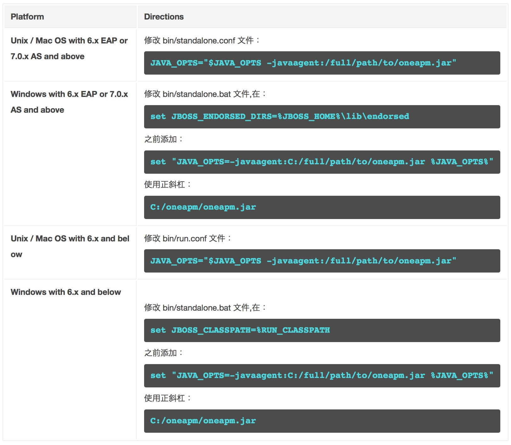

# Jboss中部署方法


* Domain mode

 domain mode 支持 JBoss versions 6.x EAP 或 7.0.x AS 及以上版本。
 
 修改 domain/configuration/domain.xml，添加 -javaagent 选项，格式如下：
```
<server-group name="main-server-group" profile="full">
  <jvm name="default">
    <jvm-options>
    <option value="-javaagent:/full/path/to/oneapm.jar"/>
  </jvm-options>
</jvm>
.
.
.
</server-group>
```
#####注意：-javaagent 选项要指向 oneapm.jar 安装的绝对路径
* Standalone mode

 ***
 #####注意：-javaagent 选项要指向 oneapm.jar 安装的绝对路径