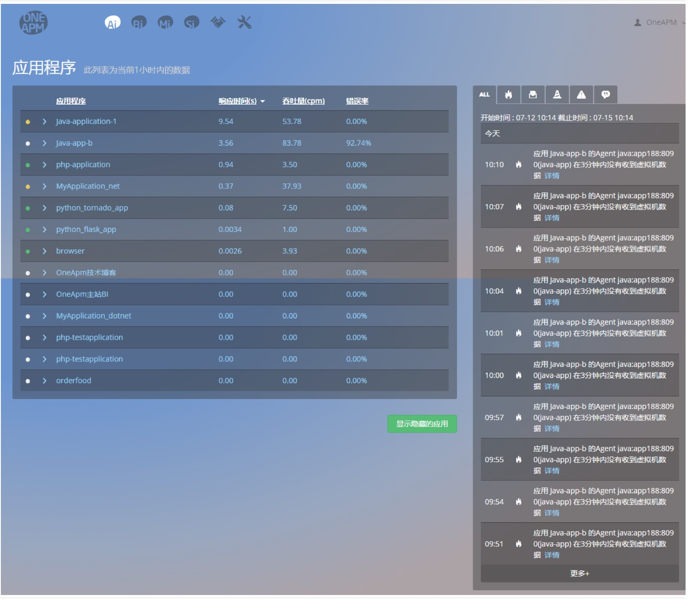

# 快速使用OneAPM指南

* Application Insight 是一个贯穿应用系统全生命周期的真实用户体验管理和应用性能管理平台级解决方案。
##目录：
 * 产品架构

 * 安装使用

 * 功能简介

 * 更多细节
 
 ####产品架构

* OneAPM Ai 由 Agent、Server、Client 三部分构成：

* Agent ：Agent 安装在被监控的应用服务器的 JVM/CLR 上，收集各种性能数据，并传输到 Server。

* Server：处理从 Agent 接收的性能数据，将数据保存到文件和数据库中，并且提供可视化图形展示等信息。Server 是由 OneAPM 提供的高性能一体机，已经含有预先配置完毕的服务端，仅需完成上架、连接电源网线、配置 IP 即可工作。

* Client：通过基于浏览器的 Client 管理界面，可以实现对 Agent 收集的性能数据的实时监控。通过应用性能数据分析、故障诊断、代码级问题定位、告警提示、历史性能对比分析等任务，实现对应用程序的性能管理。

 ####安装使用
* 目前我们主要支持以下六大语言的应用监控，您需要安装各自探针：
 * Java Agent
 * Php Agent
 * Ruby Agent
 * .Net Agent
 * Node.js Agent
 * Python Agent

 ####功能简介

 **首页**
* 该页面主要展示两个列表：应用程序列表与报警事件列表。

* 应用程序列表主要展示 Ai 监控的应用程序总览信息，包括应用名称、响应时间、吞吐量和错误率。鼠标悬停在列表最右端，会浮现修改应用程序名称的图标。

* 报警事件列表展示最新的报警事件。

 **监控**

* 该模块包含应用最重要的监控信息。主要包括：总览、拓扑、Web 事务、数据库、外部服务和后台任务六个页面。对于 Java 应用，还有 JVMs 页面，监控 Java 虚拟机的性能。

* 欲知详情，请查看：监控

  **事件**

* 该模块目前主要包括应用的错误信息。包括错误率、发生次数，以及详细的错误请求信息。

* 欲知详情，请查看：事件

 **报表**

* 该模块主要包括 Web 事务报表，数据库报表。对于 Java 应用，还有 JVM 报表。您还能以 Excel 格式下载报表。

* 欲知详情，请查看：报表

 **设置**

* 该模块包括服务器环境、应用设置和自定义事务三个页面。您可以查看应用服务器的参数配置、修改监控配置，还能按照需求定义自己关心的事务。

* 欲知详情，请查看：设置

 **关键事务**

* 该模块为您提供添加对业务影响较大的 Web 事务的入口。您还可以查看事务的拓扑情况，并进行性能剖析，深入了解该事务的执行情况。

* 欲知详情，请查看：关键事务

 **报警设置**

* 该模块为您提供添加报警事件的入口。您可以自己创建报警策略，也可以分类查看最新的报警事件。

* 欲知详情，请查看：报警设置

