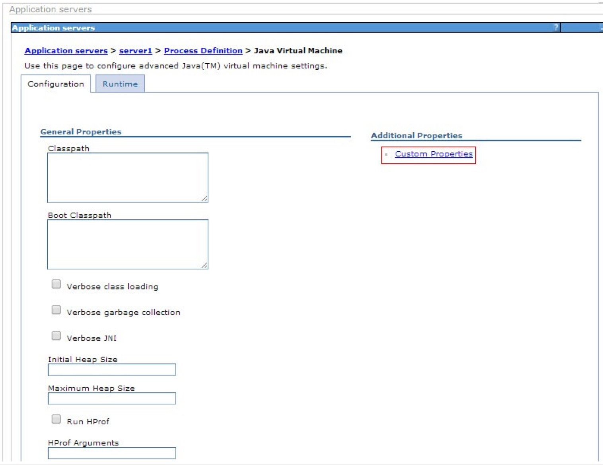
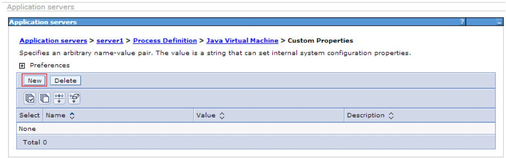
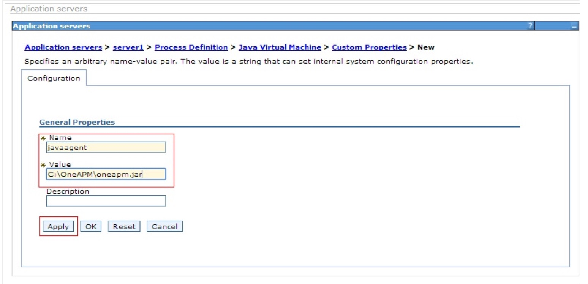

# WebSphere 中部署方法

* WebSphere 应用服务器 Java Agent 安装步骤：


* 登陆到 WebSphere 的 admin console.


* 在左侧的导航栏中选择 Servers > Application servers.


* 在 server 列表中选择要监控的 server.


* 在 the Application servers Configuration


* 标签中，选择 Java and Process Management > Process Definition.


* 在 Process definition页面中，选择 Java Virtual Machine.


### 如果您使用 Linux 操作系统：
* 在 Java Virtual Machine 页面，在 Generic JVM arguments 文本框中，添加
```
-javaagent:/full/path/to/oneapm.jar
```
* 注意：-javaagent:后面跟oneapm.jar的绝对路径


* ### 如果您使用 Windows 操作系统：
  


* 第一步：点击 Additinal Properties 下方的 Custom Properties



* 第二步：点击 Preference 下方的 New 按钮
 
 
 


* 第三步：在 Configuration 中配置 Name
 


* javaagent 和 Value 下方配置 C:\OneAPM\oneapm.jar
点击 Apply点击 Save重启服务器Servers > Application servers > Java and Process Management > Process Definition > Additional Properties > Java Virtual Machine: 在 Websphere Java Virtual Machine 页面添加 javaagent 标签
